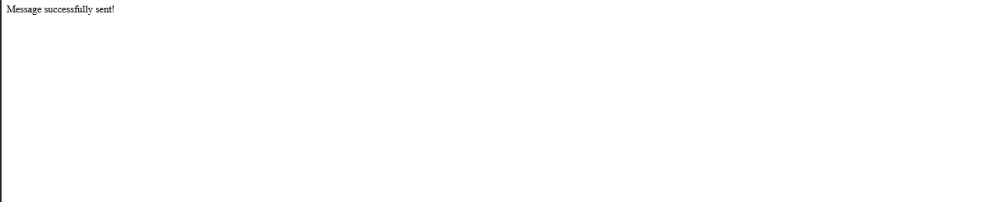

# Final Assignment |

## Hello, friends!

Welcome to the final stage of your exciting journey through the Computer Systems course 😉. Look at how much you’ve already achieved! Now, you need to complete a homework assignment, which serves as the course's final task.

This last project is not just an assignment; it’s your triumph. **Are you ready to showcase your understanding and skills?** You’ve done this before, and you can do it again 💪🏼.

This assignment is **comprehensive** and covers knowledge from various course modules.

---

## Your goal

Create a **web application** that interacts with a server using **sockets** and can store information in a **MongoDB database**.

---

## Skills to strengthen:

### 1. Working with an HTTP Server:

- Create a web application in Python without using web frameworks.
- Implement routing and handle static resources.

### 2. Working with Sockets:

- Build a simple Socket server to process data.
- Use **UDP** or **TCP** protocol for communication between the web application and the server.

### 3. Using Docker:

- Create a Docker container for the web application and the Socket server.
- Write a `Dockerfile` and a `docker-compose.yaml` file for automated deployment.

### 4. Working with MongoDB:

- Store data in a MongoDB database.
- Create records in a format applicable to real-world usage.

---

## Technical Task Description

You need to implement a **basic web application** without using a web framework.

---

## Instructions and Requirements

Following the example in the course notes, create a **web application** with routing for two HTML pages:  
`index.html` and `message.html`.

Use the provided base files.

Additionally:

- Handle static resources during the program execution: `style.css`, `logo.png`.
- Implement form handling on the `message.html` page.
- Return an `error.html` page for **404 Not Found** errors.
- Your HTTP server must run on port **3000**.

---

### For handling the form:

Create a **Socket server** on port `5000`. The workflow should be:

1. Enter data into the form.
2. The data is sent to the web application, which forwards it for processing via **sockets** (using **UDP** or **TCP** protocol) to the Socket server.
3. The Socket server converts the received byte string into a dictionary and saves it in the **MongoDB** database.

---

### MongoDB document format:

```json
{
  "date": "2022-10-29 20:20:58.020261",
  "username": "krabaton",
  "message": "First message"
},
{
  "date": "2022-10-29 20:21:11.812177",
  "username": "Krabat",
  "message": "Second message"
}
```

**The `date` key of each message** should be the message receipt time: `datetime.now()`. Each new message from the web application should be **added to the database** with the receipt time.

---

## Acceptance Criteria

1. A **single `main.py` file** is used for the web application creation.
2. The **HTTP server** and **Socket server** are launched in separate processes.
3. A **Dockerfile** is created, and the application is run as a **Docker container**.
4. A `docker-compose.yaml` file is written with configurations for the application and **MongoDB**.
5. **Docker Compose** is used to build the environment, and the `docker-compose up` command is used to start the environment.
6. **Data is saved outside the container** using volumes.
7. **Static resources** (`style.css`, `logo.png`) are handled.
8. A **404 Not Found** error returns the `error.html` page.
9. **Form handling** is organized according to the above requirements.
10. **MongoDB document format** meets the specified requirements.

## Task Result




